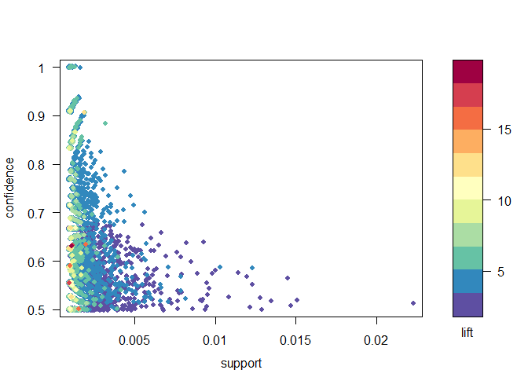

Predictive Modeling Exercises
-----------------------------

Author: Shengxiang Wu (eid: sw38274), Jing Fang (eid: jf36536)

**1. Green Buildings**
----------------------

### Introduction

She uses mean to calculate the likely rent for the new building, which
we don’t agree. The first reason is that since we know the size of the
building is going to be 250,000, and the average rents of green
buildings with size 200,000 - 300,000 compare to the similar sized
normal buildings’ rents don’t have much advantage. Unlike 7.7 years to
take back the additional fee for a green building, it will need 15.4
years if we only consider the buildings in the size range 200,000 -
300,000.

In addition, since the size is never the only factor deciding the rent,
we should consider all other information about a building to make our
estimation of the rent. For example, the position of a building might
also be important, and so does the structure of it. Obviously, an
appartment next to the center park in NYC would be more expansive than a
same sized appartment in Flushing, NY. Hence, we are going to
invastigate how all the known variables might affect the rent, and
finally make our conclusion based on our discoveris.

    df = read.csv("greenbuildings.csv", header=T)

### Data Cleaning

Since some buildings in the data set had very low occupancy rates which
is less than 10% of available space occupied, we removed these buildings
from consideration. Then we split the data set to look at the green
buildings and non-green buildings separately.

    df_select = df[df$leasing_rate >= 10,]
    df_green = df_select[df_select$green_rating == 1,]
    df_normal = df_select[df_select$green_rating == 0,]

### Data Exploration

We started with analyzing the relationship between the **size** of the
building and its **rent**. Here we ploted a graph to show how size
affects the result.

    ggplot(data=df_select, aes(size, Rent)) + 
      geom_point(aes(color = green_rating)) + 
      geom_smooth(se = FALSE) +
      labs(title = "Rent vs. Size for All Buildings")

    ## `geom_smooth()` using method = 'gam' and formula 'y ~ s(x, bs = "cs")'

    # limiting the size
    df_select_size = df_select[df_select$size >= 200000 & df_select$size <= 300000,]

    ggplot(data=df_select_size, aes(size, Rent)) + 
      geom_point(aes(color = green_rating)) + 
      geom_smooth(se = FALSE) +
      labs(title = "Rent vs. Size for Selected Buildings") # Hard to tell if green building in size range 200000 - 300000 gives more rents, and the size likely affect less in this range.

    ## `geom_smooth()` using method = 'gam' and formula 'y ~ s(x, bs = "cs")'

    df_select_size_green = df_select_size[df_select_size$green_rating == 1,]
    df_select_size_normal = df_select_size[df_select_size$green_rating == 0,]

    ggplot(data=df_select_size_green, aes(size, Rent)) + 
      geom_point(aes(color = Energystar)) + 
      geom_smooth(se = FALSE) +
      labs(title = "Rent vs. Size for Selected Green Buildings")

    ## `geom_smooth()` using method = 'loess' and formula 'y ~ x'

    ggplot(data=df_select_size_normal, aes(size, Rent)) + 
      geom_point(aes(color = Energystar)) + 
      geom_smooth(se = FALSE) +
      labs(title = "Rent vs. Size for Selected Non-Green Buildings")

    ## `geom_smooth()` using method = 'loess' and formula 'y ~ x'

**Stories**

    df2_green = df_select_size_green
    df2_normal = df_select_size_normal
    df2_select = df_select_size

    ggplot(data=df2_select, aes(stories, Rent)) + 
      geom_point(aes(color = green_rating)) + 
      geom_smooth(se = FALSE) +
      labs(title = "Rent vs. Stories for Selected Buildings") # Likely when the stories is around 10, we have more rent.

    ## `geom_smooth()` using method = 'gam' and formula 'y ~ s(x, bs = "cs")'

    ggplot(data=df2_normal, aes(stories, Rent)) + 
      geom_point(aes()) + 
      geom_smooth(se = FALSE) +
      labs(title = "Rent vs. Stories for Non-Green Buildings")

    ## `geom_smooth()` using method = 'loess' and formula 'y ~ x'

 We
could see from the graphs that even not green buildings, the stories
around 12 gives the highest rent.

    summary(df2_green$stories) # median and mean are close to 12.

    ##    Min. 1st Qu.  Median    Mean 3rd Qu.    Max. 
    ##     2.0     9.0    12.0    12.1    15.0    32.0

    summary(df2_normal$stories) # median 15, mean 16

    ##    Min. 1st Qu.  Median    Mean 3rd Qu.    Max. 
    ##    2.00   12.00   15.00   16.11   20.00   39.00

Since the mean of stories for green buildings are closer to 12, likely a
cause of higher rent.

**Empl\_gr**

    ggplot(data=df2_select, aes(empl_gr, Rent)) + 
      geom_point(aes(color = green_rating)) + 
      geom_smooth(se = FALSE) +
      labs(title = "Rent vs. empl_gr for selected buildings")

    ## `geom_smooth()` using method = 'gam' and formula 'y ~ s(x, bs = "cs")'

    ggplot(data=df2_normal, aes(empl_gr, Rent)) + 
      geom_point(aes()) + 
      geom_smooth(se = FALSE) +
      labs(title = "Rent vs. empl_gr for normal buildings")

    ## `geom_smooth()` using method = 'loess' and formula 'y ~ x'

    #Empl_gr doesn't really tell about the rent.

It looks messy, so we cannot really tell how “Empl\_gr” affects the
rent.

**Age**

    ggplot(data=df2_select, aes(age, Rent)) + 
      geom_point(aes(color = green_rating)) + 
      geom_smooth(se = FALSE) +
      labs(title = "Rent vs. Age for selected buildings")

    ## `geom_smooth()` using method = 'gam' and formula 'y ~ s(x, bs = "cs")'

    ggplot(data=df2_normal, aes(age, Rent)) + 
      geom_point(aes()) + 
      geom_smooth(se = FALSE) +
      labs(title = "Rent vs. Age for normal buildings")

    ## `geom_smooth()` using method = 'loess' and formula 'y ~ x'

Likely, older buildings are providing less Rent. However, from the plot,
we can see the green buildings are way younger.

**Renovation**

    ggplot(data=df2_select, aes(renovated, Rent)) + 
      geom_point(aes(color = green_rating)) + 
      labs(title = "Rent vs. renovation for selected buildings")

    mean(df2_normal[df2_normal$renovated == 1,]$Rent)

    ## [1] 24.93558

    mean(df2_normal[df2_normal$renovated == 0,]$Rent)

    ## [1] 33.07747

    mean(df2_green[df2_green$renovated == 1,]$Rent)

    ## [1] 30.12759

    mean(df2_green[df2_green$renovated == 0,]$Rent)

    ## [1] 31.88621

So basically, if the normal building not renovated, they are likely to
have a higher mean value than green buildings. However, more of them are
renovated compare to green buildings, which caused they look cheaper.

    d1 = df2_select %>%
      group_by(green_rating) %>%
      summarize(reno = sum(renovated==1)/n())

    ## `summarise()` ungrouping output (override with `.groups` argument)

    d1

    ## # A tibble: 2 x 2
    ##   green_rating  reno
    ##          <int> <dbl>
    ## 1            0 0.348
    ## 2            1 0.220

    ggplot(data = d1) + 
      geom_bar(mapping = aes(x=green_rating, y=reno), stat='identity') + 
      labs(title = "Renovation rate")

Clearly, green buildings are less likely renovated, so it causes higher
rent.

**Class\_a**

    ggplot(data=df2_select, aes(class_a, Rent)) + 
      geom_point(aes(color = green_rating)) + 
      labs(title = "Rent vs. class for selected buildings")

    mean(df2_normal[df2_normal$class_a == 1,]$Rent)

    ## [1] 33.39883

    mean(df2_normal[df2_normal$class_a == 0,]$Rent)

    ## [1] 25.13817

    mean(df2_green[df2_green$class_a == 1,]$Rent)

    ## [1] 32.1488

    mean(df2_green[df2_green$class_a == 0,]$Rent)

    ## [1] 26.438

Class a buildings are having higher rent. Normal class a buildings are
even more expensive with mean rent compare to class a green buildings.
However, more green buildings are likely to be class a, which caused
they are having a higher mean rent.

    d2 = df2_select %>%
      group_by(green_rating) %>%
      summarize(class = sum(class_a==1)/n())

    ## `summarise()` ungrouping output (override with `.groups` argument)

    d2

    ## # A tibble: 2 x 2
    ##   green_rating class
    ##          <int> <dbl>
    ## 1            0 0.618
    ## 2            1 0.886

    ggplot(data = d2) + 
      geom_bar(mapping = aes(x=green_rating, y=class), stat='identity') + 
      labs(title = "class_a rate")

There are more class\_a buildings in green building, and the average
rent for a class\_a building is higher.

**Net**

    ggplot(data=df2_select, aes(net, Rent)) + 
      geom_point(aes(color = green_rating)) + 
      labs(title = "Rent vs. net for selected buildings")

    mean(df2_normal[df2_normal$net == 1,]$Rent)

    ## [1] 32.23091

    mean(df2_normal[df2_normal$net == 0,]$Rent)

    ## [1] 30.2189

    mean(df2_green[df2_green$net == 1,]$Rent)

    ## [1] 21.38833

    mean(df2_green[df2_green$net == 0,]$Rent)

    ## [1] 31.98135

    d3 = df2_select %>%
      group_by(green_rating) %>%
      summarize(net = sum(net==1)/n())

    ## `summarise()` ungrouping output (override with `.groups` argument)

    d3

    ## # A tibble: 2 x 2
    ##   green_rating    net
    ##          <int>  <dbl>
    ## 1            0 0.0124
    ## 2            1 0.0455

    ggplot(data = d3) + 
      geom_bar(mapping = aes(x=green_rating, y=net), stat='identity') + 
      labs(title = "net rate")

Basically, with the net contract buildings are likely to have lower
rent, and the net rate for green building is higher. So this is not a
reason that green buildings are having higher rent.

**Amenities**

    ggplot(data=df2_select, aes(amenities, Rent)) + 
      geom_point(aes(color = green_rating)) + 
      labs(title = "Rent vs. amenities for selected buildings")

    mean(df2_normal[df2_normal$amenities == 1,]$Rent)

    ## [1] 31.0315

    mean(df2_normal[df2_normal$amenities == 0,]$Rent)

    ## [1] 27.75911

    mean(df2_green[df2_green$amenities == 1,]$Rent)

    ## [1] 31.03194

    mean(df2_green[df2_green$amenities == 0,]$Rent)

    ## [1] 33.60542

    d4 = df2_select %>%
      group_by(green_rating) %>%
      summarize(amen = sum(amenities==1)/n())

    ## `summarise()` ungrouping output (override with `.groups` argument)

    d4

    ## # A tibble: 2 x 2
    ##   green_rating  amen
    ##          <int> <dbl>
    ## 1            0 0.759
    ## 2            1 0.818

    ggplot(data = d4) + 
      geom_bar(mapping = aes(x=green_rating, y=amen), stat='identity') + 
      labs(title = "amenity rate")

 It
is hard to tell but it’s interesting that green buildings without
amenity is likely to be more expensive in rent.

**cd\_total\_07**

    ggplot(data=df2_select, aes(cd_total_07, Rent)) + 
      geom_point(aes(color = green_rating)) + 
      geom_smooth(se = FALSE) +
      labs(title = "Rent vs. cd_total_07 for selected buildings")

    ## `geom_smooth()` using method = 'gam' and formula 'y ~ s(x, bs = "cs")'

    ggplot(data=df2_green, aes(cd_total_07, Rent)) + 
      geom_point(aes()) + 
      geom_smooth(se = FALSE) +
      labs(title = "Rent vs. cd_total_07 for green buildings")

    ## `geom_smooth()` using method = 'loess' and formula 'y ~ x'

    ggplot(data=df2_normal, aes(cd_total_07, Rent)) + 
      geom_point(aes()) + 
      geom_smooth(se = FALSE) +
      labs(title = "Rent vs. cd_total_07 for normal buildings")

    ## `geom_smooth()` using method = 'loess' and formula 'y ~ x'

    #The rent is low when cd_total_07 close to 1000, high when close to 1600.
    summary(df2_green$cd_total_07) 

    ##    Min. 1st Qu.  Median    Mean 3rd Qu.    Max. 
    ##     130     684     966    1565    2269    5240

    summary(df2_normal$cd_total_07)

    ##    Min. 1st Qu.  Median    Mean 3rd Qu.    Max. 
    ##     130     684    1073    1378    1813    5240

The median of green building is close to 1000, the mean is close to
1600, hence, it is likely causing the rent goes higher for green
buildings. But it is hard to tell if the green building caused the
cd\_total\_07, or the cd\_total\_07 caused the high rent for green
buildings. Since the it is a demand on energy, it is somehow overlapping
with green building property. Hence, we will not try to analyse this and
total.dd.07, and hd.total.07.

**Cluster Rent**

    ggplot(data=df2_normal, aes(cluster_rent, Rent)) + 
      geom_point(aes()) + 
      geom_smooth(se = FALSE) +
      labs(title = "Rent vs. Cluster Rent for normal buildings")

    ## `geom_smooth()` using method = 'loess' and formula 'y ~ x'

    ggplot(data=df2_green, aes(cluster_rent, Rent)) + 
      geom_point(aes()) + 
      geom_smooth(se = FALSE) +
      labs(title = "Rent vs. Cluster Rent for green buildings")

    ## `geom_smooth()` using method = 'loess' and formula 'y ~ x'

    mean(df2_green$cluster_rent) 

    ## [1] 27.79625

    mean(df2_normal$cluster_rent)

    ## [1] 27.94306

As cluster rent increase, the rent also increase. So it is important
where the building is built no matter normal or green.

### Insights and conclusions

By only consider the size of the building in the range of 200000 -
300000, we can say that the place of the building is important, which
will affect the rent for green or non-green.

The stories may be a confounding, since the stories in the range 10-12
will make the rent higher for all buildings, but green buildings are
having median and mean close to 12, which will indeed make the green
building to have a general higher rent compare to normal buildings.

The age is another confounding variable. The older buildings are having
lower rent by the plot, and we can see most of green buildings are
younger than 50 years old, and likely below 25 years, but there are many
normal buildings have age 75-100 years. So it might be the case that
green buildings are more expensive because they are new, not because
they are green buildings.

Also, renovation will make normal building’s rent lower, but it won’t
really affect green buildings much. More than 35% of the normal
buildings are renovated, hence causing a lower rent is likely to be the
case. Since green buildings are not really affected by the renovation,
the mean rent of them might be just like it should be.

In addition, class\_a buildings are having higher rent compare to
others. More than 80% of the green buildings are class a, and indeed
class\_a normal buildings have a greater mean rent compare to class\_a
green buildings. In this case, Green building with higher mean rent
might be explained by the higher portion of class\_a buildings.

To sum up, to build a green building is not necessarily claim more rent
because the higher mean rent for green building is instead because of
the higher portion of stories closer to 12, the better age, the less
effective by the renovation and a higher portion of class\_a building.
Without spending extra 5,000,000, we might also to build a normal
building to claim good rent if we make it as a class\_a building in a
good cluster, since the age and renovation are not likely to be
considered for the new building.

**2. Flights At ABIA**
----------------------

### Introduction

As a traveler, one of the most important things that we really care
about is weather or not our flights would delay. In this problem, we
will focus on analyzing the delay situations of different flight
companies.

    df = read.csv("ABIA.csv", header=T)

### Data Cleaning

Although there are many flight companies in the data set, our group
members tend to take the flight from AA, Delta and UA, so we decided to
focus on these four companies.

    df_clean = na.omit(df)
    df_clean2 <- df_clean[, c('UniqueCarrier', 'ArrDelay', 'DepDelay', 'Origin', 'Dest')]
    df_clean2 <- df_clean2[df_clean2$UniqueCarrier %in% c('AA', 'DL', 'UA'),]

### Data Exploration

    df_plot1 <- NULL
    df_clean2 <- df_clean2[df_clean2$Origin !='AUS', ]
    list_carrier <- unique(df_clean2$UniqueCarrier)
    list_orig <- unique(df_clean2$Origin)

    for (n_carrier in 1:length(list_carrier)) {
      #n_carrier <- 1
      name_carrier <- list_carrier[n_carrier]
      df_carrier <- df_clean2[df_clean2$UniqueCarrier == name_carrier,]
      for (n_orig in 1:length(list_orig)) {
        #n_orig <- 36
        name_orig <- list_orig[n_orig]
        df_carrier_orig <- df_carrier[df_clean2$Origin == name_orig,]
        df_carrier_orig <- df_carrier_orig[complete.cases(df_carrier_orig),]
        if (nrow(df_carrier_orig)>= 1) {
          df_loop <- data.frame(name_carrier, name_orig,  mean(df_carrier_orig$ArrDelay), sd(df_carrier_orig$ArrDelay))
          
        } else {
          df_loop <- data.frame(name_carrier, name_orig,  NA, NA)
        }
        
        colnames(df_loop) <- c('Carrier', 'Origin', 'Mean', 'SD')
        df_plot1 <- rbind(df_plot1, df_loop)
       
      }
    } # the end of n_carrier
    df_plot1$Facet <- 'A'

    p1 <- ggplot(df_plot1, aes(x=Carrier, y=Mean, fill=Origin, color = Origin)) + 
      geom_bar(stat="identity", color="black", 
               position=position_dodge()) +
      geom_errorbar(aes(ymin=Mean-SD, ymax=Mean+SD), width=.2,
                    position=position_dodge(.9))  + 
      geom_text(aes(label=Origin), position=position_dodge(width=0.9), vjust=-0.25)

    p1 + labs(title = "Arrive Delay For Coming Flights")

    df_plot2 <- NULL
    df_clean2 <- df_clean[,c('UniqueCarrier', 'ArrDelay', 'DepDelay', 'Origin', 'Dest')]
    df_clean2 <- df_clean2[df_clean2$Dest !='AUS', ]
    df_clean2 <- df_clean2[df_clean2$UniqueCarrier %in% c('AA','DL','UA'), ]

    list_carrier <- unique(df_clean2$UniqueCarrier)
    list_dest <- unique(df_clean2$Dest)

    for (n_carrier in 1:length(list_carrier)) {
      #n_carrier <- 1
      name_carrier <- list_carrier[n_carrier]
      df_carrier <- df_clean2[df_clean2$UniqueCarrier == name_carrier,]
      for (n_dest in 1:length(list_dest)) {
        #n_orig <- 36
        name_dest <- list_dest[n_dest]
        df_carrier_dest <- df_carrier[df_clean2$Dest == name_dest, ]
        df_carrier_dest <- df_carrier_dest[complete.cases(df_carrier_dest),]
        if (nrow(df_carrier_dest)>= 1) {
          df_loop <- data.frame(name_carrier, name_dest,  mean(df_carrier_dest$ArrDelay), sd(df_carrier_dest$ArrDelay))
          
        } else {
          df_loop <- data.frame(name_carrier, name_dest,  NA, NA)
        }
        
        colnames(df_loop) <- c('Carrier', 'Dest', 'Mean', 'SD')
        df_plot2 <- rbind(df_plot2, df_loop)
        
      }
    } # the end of n_carrier
    df_plot2$Facet <- 'B'

    p2 <- ggplot(df_plot2, aes(x=Carrier, y=Mean, fill=Dest, color = Dest)) + 
      geom_bar(stat="identity", color="black", 
               position=position_dodge()) +
      geom_errorbar(aes(ymin=Mean-SD, ymax=Mean+SD), width=.2,
                    position=position_dodge(.9))  + 
      geom_text(aes(label=Dest), position=position_dodge(width=0.9), vjust=-0.25)

    p2 + labs(title = "Arrive Delay For Outgoing Flights")

    df_plot3 <- NULL
    df_clean2 <- df_clean[,c('UniqueCarrier', 'ArrDelay', 'DepDelay', 'Origin', 'Dest')]
    df_clean2 <- df_clean2[df_clean2$Origin !='AUS', ]
    df_clean2_arr = df_clean2
    df_clean2 <- df_clean2[df_clean2$UniqueCarrier %in% c('AA','DL','UA'), ]

    list_carrier <- unique(df_clean2$UniqueCarrier)
    list_orig <- unique(df_clean2$Origin)

    for (n_carrier in 1:length(list_carrier)) {
      #n_carrier <- 1
      name_carrier <- list_carrier[n_carrier]
      df_carrier <- df_clean2[df_clean2$UniqueCarrier == name_carrier,]
      for (n_orig in 1:length(list_orig)) {
        #n_orig <- 36
        name_orig <- list_orig[n_orig]
        df_carrier_orig <- df_carrier[df_clean2$Origin == name_orig, ]
        df_carrier_orig <- df_carrier_orig[complete.cases(df_carrier_orig),]
        if (nrow(df_carrier_orig)>= 1) {
          df_loop <- data.frame(name_carrier, name_orig,  mean(df_carrier_orig$DepDelay), sd(df_carrier_orig$DepDelay))
          
        } else {
          df_loop <- data.frame(name_carrier, name_orig,  NA, NA)
        }
        
        colnames(df_loop) <- c('Carrier', 'Origin', 'Mean', 'SD')
        df_plot3 <- rbind(df_plot3, df_loop)
        
      }
    } # the end of n_carrier
    df_plot3$Facet <- 'C'

    p3 <- ggplot(df_plot3, aes(x=Carrier, y=Mean, fill=Origin, color = Origin)) + 
      geom_bar(stat="identity", color="black", 
               position=position_dodge()) +
      geom_errorbar(aes(ymin=Mean-SD, ymax=Mean+SD), width=.2,
                    position=position_dodge(.9))  + 
      geom_text(aes(label=Origin), position=position_dodge(width=0.9), vjust=-0.25)

    p3 + labs(title = "Depart Delay For Coming Flights")

    df_plot4 <- NULL
    df_clean2 <- df_clean[,c('UniqueCarrier', 'ArrDelay', 'DepDelay', 'Origin', 'Dest')]
    df_clean2 <- df_clean2[df_clean2$Dest !='AUS', ]
    df_clean2_dep = df_clean2
    df_clean2 <- df_clean2[df_clean2$UniqueCarrier %in% c('AA','DL','UA'), ]

    list_carrier <- unique(df_clean2$UniqueCarrier)
    list_dest <- unique(df_clean2$Dest)

    for (n_carrier in 1:length(list_carrier)) {
      #n_carrier <- 1
      name_carrier <- list_carrier[n_carrier]
      df_carrier <- df_clean2[df_clean2$UniqueCarrier == name_carrier,]
      for (n_dest in 1:length(list_dest)) {
        #n_orig <- 36
        name_dest <- list_dest[n_dest]
        df_carrier_dest <- df_carrier[df_clean2$Dest == name_dest, ]
        df_carrier_dest <- df_carrier_dest[complete.cases(df_carrier_dest),]
        if (nrow(df_carrier_dest)>= 1) {
          df_loop <- data.frame(name_carrier, name_dest,  mean(df_carrier_dest$DepDelay), sd(df_carrier_dest$DepDelay))
          
        } else {
          df_loop <- data.frame(name_carrier, name_dest,  NA, NA)
        }
        
        colnames(df_loop) <- c('Carrier', 'Dest', 'Mean', 'SD')
        df_plot4 <- rbind(df_plot4, df_loop)
        
      }
    } # the end of n_carrier
    df_plot4$Facet <- 'D'

    p4 <- ggplot(df_plot4, aes(x=Carrier, y=Mean, fill=Dest, color = Dest)) + 
      geom_bar(stat="identity", color="black", 
               position=position_dodge()) +
      geom_errorbar(aes(ymin=Mean-SD, ymax=Mean+SD), width=.2,
                    position=position_dodge(.9))  + 
      geom_text(aes(label=Dest), position=position_dodge(width=0.9), vjust=-0.25)

    p4 + labs(title = "Depart Delay For Outgoing Flights")

### Insights

By building up 4 plots to analyze the depart/arrive delay for
outgoing/incoming flights at Austin, we have the following discovers: +
We should avoid taking DL, UA flight from STL to Austin, because they
are likely to delay more than an hour, and at worst can delay about 3
hours. + Except going to RDU, We should definitely avoid taking UA
flights because the plots tell us the depart delay for outgoing UA
flights are likely to be higher than other flight companies. + We should
not take UA flight to come back to Austin as well because it is likely
to delay more than other two companies’ flights.

### Conclusion

We shall not take UA except the destination or origin is RDU. After all,
AA flights are likely to delay less than other two companies. As a
result, I shall take AA if possible.

**3. Portfolio Modeling**
-------------------------

We decided to select 5 ETFs - SPY, QQQ, VTI, GLD, IVW - with different
levels of risk - SPY seems to have a relatively low risk while IVW seems
to have a relatively high risk; some of them are what we bought in the
real life.

    stocks = c("SPY", "QQQ", "VTI", "GLD", "IVW")
    prices = getSymbols(stocks, from = "2015-08-01")

    ## 'getSymbols' currently uses auto.assign=TRUE by default, but will
    ## use auto.assign=FALSE in 0.5-0. You will still be able to use
    ## 'loadSymbols' to automatically load data. getOption("getSymbols.env")
    ## and getOption("getSymbols.auto.assign") will still be checked for
    ## alternate defaults.
    ## 
    ## This message is shown once per session and may be disabled by setting 
    ## options("getSymbols.warning4.0"=FALSE). See ?getSymbols for details.

### Data Processing

We started with adjusting the prices for splits and dividends and then
computed the returns from the closing prices.

    # adjust for splits and dividends
    for(ticker in stocks) {
        expr = paste0(ticker, "a = adjustOHLC(", ticker, ")")
        eval(parse(text=expr))
    }
    returns = cbind(ClCl(SPYa),
                                    ClCl(QQQa),
                                    ClCl(VTIa),
                                    ClCl(GLDa),
                                    ClCl(IVWa))
    returns = as.matrix(na.omit(returns))

**Correlation**

    pairs(returns)

 Except GLD,
other stocks are positively correlated with each other, which makes
sense because they are based on S&P 500.

Then we started with our investments with $100,000 initial wealth and we
wanted to analyze the profit or loss of portfolios with different
weights on stocks - same weights for each stock, high weights for
low-risk stocks, and high weights for high-risk stocks. For each
portfolio, we could simulate different possible futures. **same weights
for each stock**

    set.seed(1)
    initial_wealth = 100000
    sim1 = foreach(i=1:5000, .combine='rbind') %do% {
        total_wealth = initial_wealth
        weights = c(0.2, 0.2, 0.2, 0.2, 0.2)
        holdings = weights * total_wealth
        n_days = 20
        wealthtracker = rep(0, n_days)
        for(today in 1:n_days) {
            return.today = resample(returns, 1, orig.ids=FALSE)
            holdings = holdings + holdings*return.today
            total_wealth = sum(holdings)
            wealthtracker[today] = total_wealth
        }
        wealthtracker
    }
    # each row is a simulated trajectory, each column is a data
    head(sim1)

    ##               [,1]      [,2]      [,3]      [,4]      [,5]      [,6]      [,7]
    ## result.1 101044.34 100892.46  99161.34  99621.93  99332.97  99078.51  98986.88
    ## result.2  99932.83 100859.17 101606.69 101535.01 101481.71 101776.94 101780.02
    ## result.3 100090.37  99561.57  99987.29 101650.14 101417.78 101657.20 100371.32
    ## result.4 101150.06 101191.75 101459.76 101059.89 101323.48  99446.69  99680.28
    ## result.5 100211.77  99644.46  99614.67  99845.72  99905.90 100294.27 100171.21
    ## result.6 100068.29  99481.38  99377.03  98974.03  99260.48 100600.36 100876.49
    ##               [,8]      [,9]    [,10]    [,11]    [,12]     [,13]     [,14]
    ## result.1  99225.62  99460.16 100194.9 100319.2 101114.9  99672.28  99473.57
    ## result.2 101892.31 102222.06 102931.2 102534.6 102320.4 102434.66 102466.99
    ## result.3 100766.39 100897.35 100976.0 101474.8 102619.0 103854.46 104751.84
    ## result.4  99664.37 100314.15 100418.0 101256.8 102245.2 101638.60 101147.90
    ## result.5 100185.43  99599.09 100051.0 100865.0 101260.6 101669.01 101388.85
    ## result.6 102049.47 102162.38 101410.0 101412.1 102389.4 102354.18 102651.61
    ##             [,15]     [,16]     [,17]     [,18]     [,19]     [,20]
    ## result.1  98743.9  98831.92  98885.73  99871.51  99295.33  97738.35
    ## result.2 102928.8 103309.73 103440.57 100944.37 101260.46  99847.04
    ## result.3 103586.9 103600.78 103161.18 103355.79 103241.18 103190.26
    ## result.4 101077.1 101269.71 101925.80 100184.69 100062.58  99300.48
    ## result.5 103653.5 104314.68 104604.29 104380.34 103101.46 102070.22
    ## result.6 102848.7 102818.59 102783.68 102955.92 101988.75 100965.62

    hist(sim1[,n_days], 25)

    mean(sim1[,n_days])

    ## [1] 101137

    mean(sim1[,n_days] - initial_wealth)

    ## [1] 1136.976

    hist(sim1[,n_days]- initial_wealth, breaks=30)

    # quantile(sim1[,n_days]- initial_wealth, prob=0.05)

One of the possible total earnings for 20 trading days is 1136.976.

**high weights for the stocks with low risk**

    set.seed(1)
    sim2 = foreach(i=1:5000, .combine='rbind') %do% {
        total_wealth = initial_wealth
        weights = c(0.4, 0.15, 0.15, 0.15, 0.15)
        holdings = weights * total_wealth
        n_days = 20
        wealthtracker = rep(0, n_days)
        for(today in 1:n_days) {
            return.today = resample(returns, 1, orig.ids=FALSE)
            holdings = holdings + holdings*return.today
            total_wealth = sum(holdings)
            wealthtracker[today] = total_wealth
        }
        wealthtracker
    }
    # each row is a simulated trajectory, each column is a data
    head(sim2)

    ##               [,1]      [,2]      [,3]      [,4]      [,5]      [,6]      [,7]
    ## result.1 101152.13 100963.81  99183.61  99696.93  99432.14  99155.79  99040.27
    ## result.2  99933.25 100822.95 101573.73 101482.17 101467.26 101774.15 101810.39
    ## result.3 100103.13  99549.78  99945.38 101666.19 101512.93 101693.52 100321.15
    ## result.4 101143.68 101232.17 101812.50 101455.05 101680.30  99593.96  99741.74
    ## result.5 100149.45  99085.00  99067.23  99338.37  99354.81  99682.17  99641.89
    ## result.6 100004.26  99357.85  99168.51  98839.01  99141.89 100491.13 100790.06
    ##               [,8]      [,9]     [,10]    [,11]    [,12]    [,13]     [,14]
    ## result.1  99524.88  99697.96 100438.60 100440.3 101301.2  99872.6  99690.23
    ## result.2 101977.33 102379.02 103079.13 102675.3 102529.8 102641.3 102624.99
    ## result.3 100746.32 100806.35 100911.88 101378.1 102654.4 103972.6 104894.32
    ## result.4  99697.58 100422.71 100524.05 101273.6 102295.0 101612.3 101060.36
    ## result.5  99598.54  99024.38  99497.26 100314.7 100750.4 101231.4 100928.56
    ## result.6 102042.22 102138.67 101514.18 101480.3 102642.3 102641.5 102951.79
    ##              [,15]     [,16]     [,17]    [,18]     [,19]     [,20]
    ## result.1  98913.59  99031.62  99073.06 100073.2  99500.21  97957.65
    ## result.2 102944.03 103086.03 103194.29 100679.3 101061.66  99638.89
    ## result.3 103611.83 103677.34 103181.19 103364.3 103234.91 103214.91
    ## result.4 101095.90 101276.74 101899.35 100108.6 100003.46  99266.87
    ## result.5 103200.07 103848.66 104109.43 103846.4 102433.70 101308.70
    ## result.6 103097.30 103023.68 103088.62 103224.2 102459.39 101342.49

    hist(sim2[,n_days], 25)

    mean(sim2[,n_days])

    ## [1] 101093.8

    mean(sim2[,n_days] - initial_wealth)

    ## [1] 1093.769

    hist(sim2[,n_days]- initial_wealth, breaks=30)

 One of the
possible total earnings for 20 trading days is 1093.769.

**high weights for the stocks with high risk**

    set.seed(1)
    sim3 = foreach(i=1:5000, .combine='rbind') %do% {
        total_wealth = initial_wealth
        weights = c(0.15, 0.15, 0.15, 0.15, 0.4)
        holdings = weights * total_wealth
        n_days = 20
        wealthtracker = rep(0, n_days)
        for(today in 1:n_days) {
            return.today = resample(returns, 1, orig.ids=FALSE)
            holdings = holdings + holdings*return.today
            total_wealth = sum(holdings)
            wealthtracker[today] = total_wealth
        }
        wealthtracker
    }
    # each row is a simulated trajectory, each column is a data
    head(sim3)

    ##               [,1]      [,2]      [,3]      [,4]      [,5]      [,6]      [,7]
    ## result.1 101099.66 100911.28  98933.13  99439.80  99180.14  98887.48  98802.63
    ## result.2  99945.37 100844.66 101602.21 101553.68 101583.74 101856.69 101895.66
    ## result.3 100074.80  99610.92 100069.45 101873.90 101795.69 102011.71 100600.72
    ## result.4 101121.45 101216.72 101556.59 101174.41 101451.71  99370.61  99659.42
    ## result.5 100225.87  99315.75  99271.00  99466.94  99480.69  99860.39  99783.54
    ## result.6 100145.35  99512.03  99448.78  99081.67  99449.26 100930.93 101250.00
    ##               [,8]      [,9]     [,10]     [,11]    [,12]     [,13]    [,14]
    ## result.1  99054.34  99260.86 100004.67  99996.19 100933.3  99408.04  99166.7
    ## result.2 102038.80 102464.21 103213.88 102748.36 102546.2 102640.86 102687.6
    ## result.3 100987.76 101134.65 101246.74 101683.61 102873.5 104268.81 105214.1
    ## result.4  99602.50 100371.81 100474.97 101286.16 102342.5 101666.54 101082.8
    ## result.5  99802.13  99242.33  99687.75 100552.27 101027.4 101473.87 101165.9
    ## result.6 102505.88 102560.57 101748.32 101712.33 102915.4 102961.06 103237.1
    ##              [,15]     [,16]     [,17]     [,18]     [,19]     [,20]
    ## result.1  98411.72  98514.76  98587.96  99549.57  98925.89  97316.59
    ## result.2 103089.47 103511.54 103659.51 101074.93 101474.09  99948.63
    ## result.3 103911.54 103998.96 103490.84 103664.13 103573.31 103574.40
    ## result.4 101081.85 101252.73 101901.89  99910.43  99747.39  98982.90
    ## result.5 103611.46 104253.80 104547.49 104331.36 102897.77 101724.85
    ## result.6 103343.09 103286.90 103314.79 103503.65 102515.97 101315.46

    hist(sim3[,n_days], 25)

    mean(sim3[,n_days])

    ## [1] 101160.5

    mean(sim3[,n_days] - initial_wealth)

    ## [1] 1160.512

    hist(sim3[,n_days]- initial_wealth, breaks=30)

 One of the
possible total earnings for 20 trading days is 1160.512.

### Conclusion

We run three portfolios several times and got different possible
expected returns each time, but the differences between all the
portfolios are pretty small. Since the result varies and close, we
cannot conclude which one is better.

**4. Market Segmentation**
--------------------------

### Introduction

In this problem, we will identify interesting market segments for
NutrientH20 that appear to stand out in its social-media audience.

    social_marketing = read.csv("social_marketing.csv", row.names=1)

### Data Cleaning

### Data Exploration

**Correlation** To figure out the relationship between different
variables, we started with plotting the correlation matrix.

    correlation_mat = cor(interest)
    # heatmap visualization, reorder the variables by hierarchical clustering
    ggcorrplot::ggcorrplot(correlation_mat, hc.order=TRUE, tl.cex=8)

In the correlation graph, we found that some features were highly
correlated with each other. For example, personal fitness and outdoors
are highly correlated with each other; fashion, cooking and beauty are
highly correlated with each other; college\_uni, online\_gaming and
sports\_playing are highly correlated with each other.

**Principal Component Analysis**

    pca_marketing = prcomp(interest, scale=TRUE)
    # variance plot
    plot(pca_marketing, type="line")

    summary(pca_marketing)

    ## Importance of components:
    ##                           PC1     PC2     PC3     PC4     PC5     PC6     PC7
    ## Standard deviation     2.0947 1.66891 1.59870 1.53723 1.47038 1.28596 1.22006
    ## Proportion of Variance 0.1371 0.08704 0.07987 0.07385 0.06756 0.05168 0.04652
    ## Cumulative Proportion  0.1371 0.22416 0.30403 0.37788 0.44544 0.49712 0.54364
    ##                            PC8     PC9    PC10    PC11    PC12   PC13    PC14
    ## Standard deviation     1.17870 1.05466 0.99562 0.96292 0.95849 0.9330 0.92172
    ## Proportion of Variance 0.04342 0.03476 0.03098 0.02898 0.02871 0.0272 0.02655
    ## Cumulative Proportion  0.58705 0.62181 0.65279 0.68176 0.71047 0.7377 0.76423
    ##                           PC15    PC16    PC17    PC18    PC19    PC20   PC21
    ## Standard deviation     0.90836 0.84106 0.80753 0.74817 0.69250 0.68440 0.6524
    ## Proportion of Variance 0.02579 0.02211 0.02038 0.01749 0.01499 0.01464 0.0133
    ## Cumulative Proportion  0.79001 0.81212 0.83250 0.84999 0.86497 0.87961 0.8929
    ##                          PC22    PC23   PC24   PC25    PC26    PC27   PC28
    ## Standard deviation     0.6475 0.63471 0.6274 0.6146 0.59525 0.58871 0.5514
    ## Proportion of Variance 0.0131 0.01259 0.0123 0.0118 0.01107 0.01083 0.0095
    ## Cumulative Proportion  0.9060 0.91860 0.9309 0.9427 0.95378 0.96461 0.9741
    ##                           PC29    PC30    PC31    PC32
    ## Standard deviation     0.48227 0.47638 0.43701 0.42172
    ## Proportion of Variance 0.00727 0.00709 0.00597 0.00556
    ## Cumulative Proportion  0.98138 0.98847 0.99444 1.00000

    var <- apply(pca_marketing$x, 2, var)
    prop <- var / sum(var)
    plot(cumsum(prop), xlab = "PC", ylab = "Proportion of variance explained")

    min(which(cumsum(prop) > 0.8)) # 16

    ## [1] 16

We found that when it reached to PC16, nearly 80% of variance could be
explained.

    varimax(pca_marketing$rotation[, 1:16])$loadings

    ## 
    ## Loadings:
    ##                  PC1    PC2    PC3    PC4    PC5    PC6    PC7    PC8    PC9   
    ## current_events                                                                 
    ## travel                          0.603                                          
    ## photo_sharing           -0.132                              0.625              
    ## tv_film                                             -0.659                     
    ## sports_fandom     0.432                                            0.145       
    ## politics                        0.498                              0.270       
    ## food              0.409                0.141                                   
    ## family            0.347                                     0.140              
    ## home_and_garden                                                                
    ## music                                                                          
    ## news                            0.114                              0.630       
    ## online_gaming                                -0.619                            
    ## shopping                 0.129                              0.747              
    ## health_nutrition                       0.591                                   
    ## college_uni                                  -0.595                            
    ## sports_playing                               -0.505                            
    ## cooking                 -0.574         0.113                                   
    ## eco                                                                            
    ## computers                       0.588                                          
    ## business                                                                       
    ## outdoors                               0.519                                   
    ## crafts                                                                         
    ## automotive                     -0.138                              0.683       
    ## art                                                 -0.737                     
    ## religion          0.461                                                        
    ## beauty                  -0.558                                                 
    ## parenting         0.441                                                        
    ## dating           -0.138                                                  -0.895
    ## school            0.304                                                  -0.405
    ## personal_fitness                       0.578                                   
    ## fashion                 -0.562                                                 
    ## small_business                                                                 
    ##                  PC10   PC11   PC12   PC13   PC14   PC15   PC16  
    ## current_events          -0.998                                   
    ## travel                                                           
    ## photo_sharing                                                    
    ## tv_film          -0.263                                          
    ## sports_fandom                                                    
    ## politics                                                         
    ## food                                                             
    ## family                                                           
    ## home_and_garden                -0.998                            
    ## music            -0.909                                          
    ## news                                                             
    ## online_gaming     0.115                                          
    ## shopping                                                         
    ## health_nutrition                                                 
    ## college_uni                                                      
    ## sports_playing                                                   
    ## cooking                                                          
    ## eco                                           0.992              
    ## computers                                                        
    ## business                                            -0.997       
    ## outdoors                                                         
    ## crafts                                                     -0.996
    ## automotive                                                       
    ## art               0.249                                          
    ## religion                                                         
    ## beauty                                                           
    ## parenting                                                        
    ## dating                                                           
    ## school                                                           
    ## personal_fitness                                                 
    ## fashion                                                          
    ## small_business                         0.998                     
    ## 
    ##                  PC1   PC2   PC3   PC4   PC5   PC6   PC7   PC8   PC9  PC10
    ## SS loadings    1.000 1.000 1.000 1.000 1.000 1.000 1.000 1.000 1.000 1.000
    ## Proportion Var 0.031 0.031 0.031 0.031 0.031 0.031 0.031 0.031 0.031 0.031
    ## Cumulative Var 0.031 0.062 0.094 0.125 0.156 0.188 0.219 0.250 0.281 0.312
    ##                 PC11  PC12  PC13  PC14  PC15  PC16
    ## SS loadings    1.000 1.000 1.000 1.000 1.000 1.000
    ## Proportion Var 0.031 0.031 0.031 0.031 0.031 0.031
    ## Cumulative Var 0.344 0.375 0.406 0.438 0.469 0.500

**K-Means Clustering**

    cluster_data = as.data.frame(pca_marketing$x[,1:16])
    # run k-means
    cluster1 = kmeanspp(cluster_data, 5, nstart=15)
    plotcluster(interest, cluster1$cluster)

    scale_df = scale(interest, center=TRUE, scale=TRUE)
    mu = attr(scale_df, "scaled:center")
    sigma = attr(scale_df, "scaled:scale")
    cluster_df <- as.data.frame(cbind(cluster1$center[1,]*sigma + mu, 
                                cluster1$center[2,]*sigma + mu,
                                cluster1$center[3,]*sigma + mu,
                                cluster1$center[4,]*sigma + mu,
                                cluster1$center[5,]*sigma + mu))

    summary(cluster_df)

    ##        V1                V2                V3                V4         
    ##  Min.   :-1.8718   Min.   : 0.2925   Min.   :-1.4540   Min.   :-5.4645  
    ##  1st Qu.: 0.6059   1st Qu.: 0.9194   1st Qu.: 0.5068   1st Qu.: 0.4236  
    ##  Median : 0.7648   Median : 1.2533   Median : 0.8176   Median : 0.9179  
    ##  Mean   : 0.9107   Mean   : 1.9975   Mean   : 0.9597   Mean   : 1.1583  
    ##  3rd Qu.: 1.3309   3rd Qu.: 1.8871   3rd Qu.: 1.3818   3rd Qu.: 1.5337  
    ##  Max.   : 2.6999   Max.   :12.6187   Max.   : 5.3025   Max.   : 7.9416  
    ##        V5         
    ##  Min.   :-0.6016  
    ##  1st Qu.: 0.5716  
    ##  Median : 0.9017  
    ##  Mean   : 1.6837  
    ##  3rd Qu.: 1.4284  
    ##  Max.   :14.0722

    cluster_df$interest = row.names(cluster_df)

    ggplot(cluster_df, aes(x = reorder(interest, -V1), y=V1)) +
      geom_bar(stat="identity", position="dodge") +
      theme_bw() +
      theme(axis.text.x=element_text(angle=-40)) +
      labs(title="Cluster 1", x="Interest", y="Clustering Value", cex=0.5)

    ggplot(cluster_df, aes(x = reorder(interest, -V2), y=V2)) +
      geom_bar(stat="identity", position="dodge") +
      theme_bw() +
      theme(axis.text.x=element_text(angle=-40)) +
      labs(title="Cluster 2", x="Interest", y="Clustering Value", cex=0.5)

    ggplot(cluster_df, aes(x = reorder(interest, -V3), y=V3)) +
      geom_bar(stat="identity", position="dodge") +
      theme_bw() +
      theme(axis.text.x=element_text(angle=-40)) +
      labs(title="Cluster 3", x="Interest", y="Clustering Value", cex=0.5)

    ggplot(cluster_df, aes(x = reorder(interest, -V4), y=V4)) +
      geom_bar(stat="identity", position="dodge") +
      theme_bw() +
      theme(axis.text.x=element_text(angle=-40)) +
      labs(title="Cluster 4", x="Interest", y="Clustering Value", cex=0.5)

    ggplot(cluster_df, aes(x = reorder(interest, -V5), y=V5)) +
      geom_bar(stat="identity", position="dodge") +
      theme_bw() +
      theme(axis.text.x=element_text(angle=-40)) +
      labs(title="Cluster 5", x="Interest", y="Clustering Value", cex=0.5)

\#\#\# Conclusion We could help NutrientH20 to perform specific
marketing campaigns by identifing interesting market segments for it.
Based on the outputs, we found that cooking, travel, health\_nutrition
and sports\_fandom appear most among different clusterings. So we
recommend NutrientH20 to advertise on fields such as cooking, travel,
health\_nutrition or sports\_fandom.

**5. Author Attribution**
-------------------------

### Data Processing

**Training Set**

    precess_file <- function(filename) {
      readPlain(elem=list(content=readLines(filename)), id=filename, language='en')
    }
    train_articles <- dir("../Documents/predictive_modeling_exercises/ReutersC50/C50train/", recursive=TRUE, full.names=TRUE, pattern='/*.txt')
    author_list <- dir("../Documents/predictive_modeling_exercises/ReutersC50/C50train/")
    train_authors <- NULL
    for (author in author_list) {
      train_authors = append(train_authors, rep(author, 50))
    }

    train_df = lapply(train_articles, precess_file)
    train_corpus = Corpus(VectorSource(train_df))
    train_corpus = tm_map(train_corpus, content_transformer(tolower))
    train_corpus = tm_map(train_corpus, content_transformer(removePunctuation))
    train_corpus = tm_map(train_corpus, content_transformer(stripWhitespace))
    train_corpus = tm_map(train_corpus, content_transformer(removeNumbers))

    train_DTM = DocumentTermMatrix(train_corpus)
    clean_train_DTM = removeSparseTerms(train_DTM, .99)
    tf_idf = weightTfIdf(clean_train_DTM)
    train_mat <- as.matrix(tf_idf)
    train_mat <- train_mat[,which(colSums(train_mat) != 0)]

**Test Set**

    test_articles <- dir("../Documents/predictive_modeling_exercises/ReutersC50/C50test/", recursive=TRUE, full.names=TRUE, pattern='/*.txt')
    test_author_list <- dir("../Documents/predictive_modeling_exercises/ReutersC50/C50test/")
    test_authors <- NULL
    for (author in test_author_list) {
      test_authors = append(test_authors, rep(author, 50))
    }

    test_df = lapply(test_articles, precess_file)
    test_corpus = Corpus(VectorSource(test_df))
    test_corpus = tm_map(test_corpus, content_transformer(tolower))
    test_corpus = tm_map(test_corpus, content_transformer(removePunctuation))
    test_corpus = tm_map(test_corpus, content_transformer(stripWhitespace))
    test_corpus = tm_map(test_corpus, content_transformer(removeNumbers))

    test_DTM = DocumentTermMatrix(test_corpus, list(dictionary=colnames(train_DTM)))
    clean_test_DTM = removeSparseTerms(test_DTM, .99)
    test_tf_idf = weightTfIdf(clean_test_DTM)
    test_mat <- as.matrix(test_tf_idf)
    test_mat <- test_mat[,which(colSums(test_mat) != 0)]

### Principal Component Analysis

    intersect = intersect(colnames(train_mat), colnames(test_mat))
    train_mat = train_mat[,intersect]
    test_mat = test_mat[,intersect]
    pca_train = prcomp(train_mat, scale=TRUE)
    pca_predict = predict(pca_train, newdata = test_mat)
    # variance plot
    plot(pca_train, type="line")

    var <- apply(pca_train$x, 2, var)
    prop <- var / sum(var)
    plot(cumsum(prop), xlab = "PC", ylab = "Proportion of variance explained", cex = 0.05)

    sum(var[1:800] / sum(var)) # 0.7905833

    ## [1] 0.7905833

We found that when it reached to PC800, nearly 80% of variance could be
explained.

### Classification Models

Before performing classification models, we started with setting up our
training and test data sets based on the previous output.

    train = data.frame(pca_train$x[,1:800])
    train['author'] = train_authors
    train_loading = pca_train$rotation[,1:800]

    test_temp <- scale(test_mat) %*% train_loading
    test <- as.data.frame(test_temp)
    test['author']= test_authors

**Naive Bayes**

    naive_bayes = naiveBayes(as.factor(author)~., data=train)
    naive_bayes_pred = predict(naive_bayes, test)
    actual_author = as.factor(test$author)
    naive_bayes_result <- as.data.frame(cbind(actual_author, naive_bayes_pred))
    naive_bayes_result$correct <- ifelse(naive_bayes_result$actual_author == naive_bayes_result$naive_bayes_pred, 1, 0)
    # accuracy
    naive_bayes_accuracy = sum(naive_bayes_result$correct) / nrow(naive_bayes_result) # 0.2996
    naive_bayes_accuracy

    ## [1] 0.2996

The accuracy of Naive Bayes is 29.96%.

**K Nearest Neighbors**

    train.X = subset(train, select = -c(author))
    test.X = subset(test, select = -c(author))
    train.Y = as.factor(train$author)
    test.Y = as.factor(test$author)
    set.seed(1)
    knn_pred = knn(train.X, test.X, train.Y, k=1)
    knn_result = as.data.frame(cbind(test.Y, knn_pred))
    knn_result$correct <- ifelse(knn_result$test.Y == knn_result$knn_pred, 1, 0)
    # accuracy
    knn_accuracy = sum(knn_result$correct) / nrow(knn_result) # 0.338
    knn_accuracy

    ## [1] 0.338

The accuracy of K Nearest Neighbors is 33.8%.

**Random Forest**

    set.seed(1)
    random_forest = randomForest(as.factor(author)~., data=train, mtry=10, importance=TRUE)
    random_forest_pred = predict(random_forest, data=test)

    random_forest_result = as.data.frame(cbind(actual_author, random_forest_pred))
    random_forest_result$correct <- ifelse(random_forest_result$actual_author == random_forest_result$random_forest_pred, 1, 0)
    # accuracy
    random_forest_accuracy = sum(random_forest_result$correct) / nrow(random_forest_result) # 
    random_forest_accuracy

    ## [1] 0.7648

The accuracy of Random Forest is 76.48%.

### Conclusion

    result = data.frame("Model"=c("Naive Bayes", "K Nearest Neighbors", "Random Forest"), "Accuracy"=c(naive_bayes_accuracy, knn_accuracy, random_forest_accuracy))
    result

    ##                 Model Accuracy
    ## 1         Naive Bayes   0.2996
    ## 2 K Nearest Neighbors   0.3380
    ## 3       Random Forest   0.7648

Compared with other models, Random Forest performed best with an
accuracy of 76.48%. However, the time complexity of Random Forest is not
good, which took nearly 5 mins to get the result. We suspected that it
might require massive resources for the computer to build up a Random
Forest model.

**6. Association Rule Mining**
------------------------------

    df = read.transactions('Groceries.txt', sep = ',')
    arules::inspect(head(df,5))

    ##     items                     
    ## [1] {citrus fruit,            
    ##      margarine,               
    ##      ready soups,             
    ##      semi-finished bread}     
    ## [2] {coffee,                  
    ##      tropical fruit,          
    ##      yogurt}                  
    ## [3] {whole milk}              
    ## [4] {cream cheese,            
    ##      meat spreads,            
    ##      pip fruit,               
    ##      yogurt}                  
    ## [5] {condensed milk,          
    ##      long life bakery product,
    ##      other vegetables,        
    ##      whole milk}

### Data Exploration

    arules::inspect(frequentItems)

    ##     items              support   transIdenticalToItemsets count
    ## [1] {whole milk}       0.2555160 2513                     2513 
    ## [2] {other vegetables} 0.1934926 1903                     1903 
    ## [3] {rolls/buns}       0.1839349 1809                     1809 
    ## [4] {yogurt}           0.1395018 1372                     1372 
    ## [5] {soda}             0.1743772 1715                     1715 
    ## [6] {root vegetables}  0.1089985 1072                     1072 
    ## [7] {tropical fruit}   0.1049314 1032                     1032 
    ## [8] {bottled water}    0.1105236 1087                     1087

    itemFrequencyPlot(df, topN=15, type="absolute", main="Item Frequency")

Support represents the number of transaction containing the target items
divided by the total number of transactions. Confidence represents how
the target items are likely to be bought together. We started with
setting support as 0.001 and confidence as 0.5.

    # arules::inspect the top 5 rules in terms of lift:
    arules::inspect(head(sort(rules, by ="lift"),5))

    ##     lhs                                   rhs              support    
    ## [1] {Instant food products,soda}       => {hamburger meat} 0.001220132
    ## [2] {popcorn,soda}                     => {salty snack}    0.001220132
    ## [3] {baking powder,flour}              => {sugar}          0.001016777
    ## [4] {ham,processed cheese}             => {white bread}    0.001931876
    ## [5] {Instant food products,whole milk} => {hamburger meat} 0.001525165
    ##     confidence coverage    lift     count
    ## [1] 0.6315789  0.001931876 18.99565 12   
    ## [2] 0.6315789  0.001931876 16.69779 12   
    ## [3] 0.5555556  0.001830198 16.40807 10   
    ## [4] 0.6333333  0.003050330 15.04549 19   
    ## [5] 0.5000000  0.003050330 15.03823 15

    # Scatter plot of rules:
    plot(rules,control=list(col=brewer.pal(11,"Spectral")),main="") #Evaluation metric relationship

    ## To reduce overplotting, jitter is added! Use jitter = 0 to prevent jitter.

    set.seed(1)
    plot(subrules2, method="graph",control=list(type="items",main="")) # Graph-based visualization of the top ten rules in terms of lift.

    ## Available control parameters (with default values):
    ## main  =  Graph for 10 rules
    ## nodeColors    =  c("#66CC6680", "#9999CC80")
    ## nodeCol   =  c("#EE0000FF", "#EE0303FF", "#EE0606FF", "#EE0909FF", "#EE0C0CFF", "#EE0F0FFF", "#EE1212FF", "#EE1515FF", "#EE1818FF", "#EE1B1BFF", "#EE1E1EFF", "#EE2222FF", "#EE2525FF", "#EE2828FF", "#EE2B2BFF", "#EE2E2EFF", "#EE3131FF", "#EE3434FF", "#EE3737FF", "#EE3A3AFF", "#EE3D3DFF", "#EE4040FF", "#EE4444FF", "#EE4747FF", "#EE4A4AFF", "#EE4D4DFF", "#EE5050FF", "#EE5353FF", "#EE5656FF", "#EE5959FF", "#EE5C5CFF", "#EE5F5FFF", "#EE6262FF", "#EE6666FF", "#EE6969FF", "#EE6C6CFF", "#EE6F6FFF", "#EE7272FF", "#EE7575FF",  "#EE7878FF", "#EE7B7BFF", "#EE7E7EFF", "#EE8181FF", "#EE8484FF", "#EE8888FF", "#EE8B8BFF", "#EE8E8EFF", "#EE9191FF", "#EE9494FF", "#EE9797FF", "#EE9999FF", "#EE9B9BFF", "#EE9D9DFF", "#EE9F9FFF", "#EEA0A0FF", "#EEA2A2FF", "#EEA4A4FF", "#EEA5A5FF", "#EEA7A7FF", "#EEA9A9FF", "#EEABABFF", "#EEACACFF", "#EEAEAEFF", "#EEB0B0FF", "#EEB1B1FF", "#EEB3B3FF", "#EEB5B5FF", "#EEB7B7FF", "#EEB8B8FF", "#EEBABAFF", "#EEBCBCFF", "#EEBDBDFF", "#EEBFBFFF", "#EEC1C1FF", "#EEC3C3FF", "#EEC4C4FF", "#EEC6C6FF", "#EEC8C8FF",  "#EEC9C9FF", "#EECBCBFF", "#EECDCDFF", "#EECFCFFF", "#EED0D0FF", "#EED2D2FF", "#EED4D4FF", "#EED5D5FF", "#EED7D7FF", "#EED9D9FF", "#EEDBDBFF", "#EEDCDCFF", "#EEDEDEFF", "#EEE0E0FF", "#EEE1E1FF", "#EEE3E3FF", "#EEE5E5FF", "#EEE7E7FF", "#EEE8E8FF", "#EEEAEAFF", "#EEECECFF", "#EEEEEEFF")
    ## edgeCol   =  c("#474747FF", "#494949FF", "#4B4B4BFF", "#4D4D4DFF", "#4F4F4FFF", "#515151FF", "#535353FF", "#555555FF", "#575757FF", "#595959FF", "#5B5B5BFF", "#5E5E5EFF", "#606060FF", "#626262FF", "#646464FF", "#666666FF", "#686868FF", "#6A6A6AFF", "#6C6C6CFF", "#6E6E6EFF", "#707070FF", "#727272FF", "#747474FF", "#767676FF", "#787878FF", "#7A7A7AFF", "#7C7C7CFF", "#7E7E7EFF", "#808080FF", "#828282FF", "#848484FF", "#868686FF", "#888888FF", "#8A8A8AFF", "#8C8C8CFF", "#8D8D8DFF", "#8F8F8FFF", "#919191FF", "#939393FF",  "#959595FF", "#979797FF", "#999999FF", "#9A9A9AFF", "#9C9C9CFF", "#9E9E9EFF", "#A0A0A0FF", "#A2A2A2FF", "#A3A3A3FF", "#A5A5A5FF", "#A7A7A7FF", "#A9A9A9FF", "#AAAAAAFF", "#ACACACFF", "#AEAEAEFF", "#AFAFAFFF", "#B1B1B1FF", "#B3B3B3FF", "#B4B4B4FF", "#B6B6B6FF", "#B7B7B7FF", "#B9B9B9FF", "#BBBBBBFF", "#BCBCBCFF", "#BEBEBEFF", "#BFBFBFFF", "#C1C1C1FF", "#C2C2C2FF", "#C3C3C4FF", "#C5C5C5FF", "#C6C6C6FF", "#C8C8C8FF", "#C9C9C9FF", "#CACACAFF", "#CCCCCCFF", "#CDCDCDFF", "#CECECEFF", "#CFCFCFFF", "#D1D1D1FF",  "#D2D2D2FF", "#D3D3D3FF", "#D4D4D4FF", "#D5D5D5FF", "#D6D6D6FF", "#D7D7D7FF", "#D8D8D8FF", "#D9D9D9FF", "#DADADAFF", "#DBDBDBFF", "#DCDCDCFF", "#DDDDDDFF", "#DEDEDEFF", "#DEDEDEFF", "#DFDFDFFF", "#E0E0E0FF", "#E0E0E0FF", "#E1E1E1FF", "#E1E1E1FF", "#E2E2E2FF", "#E2E2E2FF", "#E2E2E2FF")
    ## alpha     =  0.5
    ## cex   =  1
    ## itemLabels    =  TRUE
    ## labelCol  =  #000000B3
    ## measureLabels     =  FALSE
    ## precision     =  3
    ## layout    =  NULL
    ## layoutParams  =  list()
    ## arrowSize     =  0.5
    ## engine    =  igraph
    ## plot  =  TRUE
    ## plot_options  =  list()
    ## max   =  100
    ## verbose   =  FALSE

 In the
lift method plot, we found that 1. The chance of buying main food was
higher than buying other categories of food. For example, people were
likely to buy ham with whitebread than buying soda with salty snack. 2.
Causality of buying one junk food to another was stronger than buying
the other categories of food. For example, buying hamburger meat after
buying soda was more likely to happen than buying vegetables then cream
cheese.

    subrules3 <- head(sort(rules, by="confidence"), 10)
    set.seed(1)
    plot(subrules3, method="graph",control=list(type="items",main=""))

    ## Available control parameters (with default values):
    ## main  =  Graph for 10 rules
    ## nodeColors    =  c("#66CC6680", "#9999CC80")
    ## nodeCol   =  c("#EE0000FF", "#EE0303FF", "#EE0606FF", "#EE0909FF", "#EE0C0CFF", "#EE0F0FFF", "#EE1212FF", "#EE1515FF", "#EE1818FF", "#EE1B1BFF", "#EE1E1EFF", "#EE2222FF", "#EE2525FF", "#EE2828FF", "#EE2B2BFF", "#EE2E2EFF", "#EE3131FF", "#EE3434FF", "#EE3737FF", "#EE3A3AFF", "#EE3D3DFF", "#EE4040FF", "#EE4444FF", "#EE4747FF", "#EE4A4AFF", "#EE4D4DFF", "#EE5050FF", "#EE5353FF", "#EE5656FF", "#EE5959FF", "#EE5C5CFF", "#EE5F5FFF", "#EE6262FF", "#EE6666FF", "#EE6969FF", "#EE6C6CFF", "#EE6F6FFF", "#EE7272FF", "#EE7575FF",  "#EE7878FF", "#EE7B7BFF", "#EE7E7EFF", "#EE8181FF", "#EE8484FF", "#EE8888FF", "#EE8B8BFF", "#EE8E8EFF", "#EE9191FF", "#EE9494FF", "#EE9797FF", "#EE9999FF", "#EE9B9BFF", "#EE9D9DFF", "#EE9F9FFF", "#EEA0A0FF", "#EEA2A2FF", "#EEA4A4FF", "#EEA5A5FF", "#EEA7A7FF", "#EEA9A9FF", "#EEABABFF", "#EEACACFF", "#EEAEAEFF", "#EEB0B0FF", "#EEB1B1FF", "#EEB3B3FF", "#EEB5B5FF", "#EEB7B7FF", "#EEB8B8FF", "#EEBABAFF", "#EEBCBCFF", "#EEBDBDFF", "#EEBFBFFF", "#EEC1C1FF", "#EEC3C3FF", "#EEC4C4FF", "#EEC6C6FF", "#EEC8C8FF",  "#EEC9C9FF", "#EECBCBFF", "#EECDCDFF", "#EECFCFFF", "#EED0D0FF", "#EED2D2FF", "#EED4D4FF", "#EED5D5FF", "#EED7D7FF", "#EED9D9FF", "#EEDBDBFF", "#EEDCDCFF", "#EEDEDEFF", "#EEE0E0FF", "#EEE1E1FF", "#EEE3E3FF", "#EEE5E5FF", "#EEE7E7FF", "#EEE8E8FF", "#EEEAEAFF", "#EEECECFF", "#EEEEEEFF")
    ## edgeCol   =  c("#474747FF", "#494949FF", "#4B4B4BFF", "#4D4D4DFF", "#4F4F4FFF", "#515151FF", "#535353FF", "#555555FF", "#575757FF", "#595959FF", "#5B5B5BFF", "#5E5E5EFF", "#606060FF", "#626262FF", "#646464FF", "#666666FF", "#686868FF", "#6A6A6AFF", "#6C6C6CFF", "#6E6E6EFF", "#707070FF", "#727272FF", "#747474FF", "#767676FF", "#787878FF", "#7A7A7AFF", "#7C7C7CFF", "#7E7E7EFF", "#808080FF", "#828282FF", "#848484FF", "#868686FF", "#888888FF", "#8A8A8AFF", "#8C8C8CFF", "#8D8D8DFF", "#8F8F8FFF", "#919191FF", "#939393FF",  "#959595FF", "#979797FF", "#999999FF", "#9A9A9AFF", "#9C9C9CFF", "#9E9E9EFF", "#A0A0A0FF", "#A2A2A2FF", "#A3A3A3FF", "#A5A5A5FF", "#A7A7A7FF", "#A9A9A9FF", "#AAAAAAFF", "#ACACACFF", "#AEAEAEFF", "#AFAFAFFF", "#B1B1B1FF", "#B3B3B3FF", "#B4B4B4FF", "#B6B6B6FF", "#B7B7B7FF", "#B9B9B9FF", "#BBBBBBFF", "#BCBCBCFF", "#BEBEBEFF", "#BFBFBFFF", "#C1C1C1FF", "#C2C2C2FF", "#C3C3C4FF", "#C5C5C5FF", "#C6C6C6FF", "#C8C8C8FF", "#C9C9C9FF", "#CACACAFF", "#CCCCCCFF", "#CDCDCDFF", "#CECECEFF", "#CFCFCFFF", "#D1D1D1FF",  "#D2D2D2FF", "#D3D3D3FF", "#D4D4D4FF", "#D5D5D5FF", "#D6D6D6FF", "#D7D7D7FF", "#D8D8D8FF", "#D9D9D9FF", "#DADADAFF", "#DBDBDBFF", "#DCDCDCFF", "#DDDDDDFF", "#DEDEDEFF", "#DEDEDEFF", "#DFDFDFFF", "#E0E0E0FF", "#E0E0E0FF", "#E1E1E1FF", "#E1E1E1FF", "#E2E2E2FF", "#E2E2E2FF", "#E2E2E2FF")
    ## alpha     =  0.5
    ## cex   =  1
    ## itemLabels    =  TRUE
    ## labelCol  =  #000000B3
    ## measureLabels     =  FALSE
    ## precision     =  3
    ## layout    =  NULL
    ## layoutParams  =  list()
    ## arrowSize     =  0.5
    ## engine    =  igraph
    ## plot  =  TRUE
    ## plot_options  =  list()
    ## max   =  100
    ## verbose   =  FALSE

 In the
plot by confidence, we found that 1. Different from the lift plot, the
causality of buying healthy food was stronger than buying other kind of
food. For example, people were most likely to buy other vegetables after
buying soft cheese. 2. Most of the items were purchased with whole milk.

Since the market has a huge amount of transaction, support must not be
above 0.002, however, confidence can be very large. Then we increased
confidence to 0.9.

    # arules::inspect the top 5 rules in terms of lift:
    arules::inspect(head(sort(rules2, by ="lift"), 5))

    ##     lhs                        rhs                   support confidence    coverage      lift count
    ## [1] {liquor,                                                                                       
    ##      red/blush wine}        => {bottled beer}    0.001931876  0.9047619 0.002135231 11.235269    19
    ## [2] {citrus fruit,                                                                                 
    ##      fruit/vegetable juice,                                                                        
    ##      other vegetables,                                                                             
    ##      soda}                  => {root vegetables} 0.001016777  0.9090909 0.001118454  8.340400    10
    ## [3] {oil,                                                                                          
    ##      other vegetables,                                                                             
    ##      tropical fruit,                                                                               
    ##      whole milk,                                                                                   
    ##      yogurt}                => {root vegetables} 0.001016777  0.9090909 0.001118454  8.340400    10
    ## [4] {butter,                                                                                       
    ##      cream cheese,                                                                                 
    ##      root vegetables}       => {yogurt}          0.001016777  0.9090909 0.001118454  6.516698    10
    ## [5] {butter,                                                                                       
    ##      sliced cheese,                                                                                
    ##      tropical fruit,                                                                               
    ##      whole milk}            => {yogurt}          0.001016777  0.9090909 0.001118454  6.516698    10

    # Scatter plot of rules:
    plot(rules2,control=list(col=brewer.pal(11,"Spectral")),main="") #Evaluation metric relationship

    ## To reduce overplotting, jitter is added! Use jitter = 0 to prevent jitter.

    subrules22 <- head(sort(rules2, by="lift"), 10)
    set.seed(1)
    plot(subrules22, method="graph",control=list(type="items",main=""))#Graph-based visualization of the top ten rules in terms of lift.

    ## Available control parameters (with default values):
    ## main  =  Graph for 10 rules
    ## nodeColors    =  c("#66CC6680", "#9999CC80")
    ## nodeCol   =  c("#EE0000FF", "#EE0303FF", "#EE0606FF", "#EE0909FF", "#EE0C0CFF", "#EE0F0FFF", "#EE1212FF", "#EE1515FF", "#EE1818FF", "#EE1B1BFF", "#EE1E1EFF", "#EE2222FF", "#EE2525FF", "#EE2828FF", "#EE2B2BFF", "#EE2E2EFF", "#EE3131FF", "#EE3434FF", "#EE3737FF", "#EE3A3AFF", "#EE3D3DFF", "#EE4040FF", "#EE4444FF", "#EE4747FF", "#EE4A4AFF", "#EE4D4DFF", "#EE5050FF", "#EE5353FF", "#EE5656FF", "#EE5959FF", "#EE5C5CFF", "#EE5F5FFF", "#EE6262FF", "#EE6666FF", "#EE6969FF", "#EE6C6CFF", "#EE6F6FFF", "#EE7272FF", "#EE7575FF",  "#EE7878FF", "#EE7B7BFF", "#EE7E7EFF", "#EE8181FF", "#EE8484FF", "#EE8888FF", "#EE8B8BFF", "#EE8E8EFF", "#EE9191FF", "#EE9494FF", "#EE9797FF", "#EE9999FF", "#EE9B9BFF", "#EE9D9DFF", "#EE9F9FFF", "#EEA0A0FF", "#EEA2A2FF", "#EEA4A4FF", "#EEA5A5FF", "#EEA7A7FF", "#EEA9A9FF", "#EEABABFF", "#EEACACFF", "#EEAEAEFF", "#EEB0B0FF", "#EEB1B1FF", "#EEB3B3FF", "#EEB5B5FF", "#EEB7B7FF", "#EEB8B8FF", "#EEBABAFF", "#EEBCBCFF", "#EEBDBDFF", "#EEBFBFFF", "#EEC1C1FF", "#EEC3C3FF", "#EEC4C4FF", "#EEC6C6FF", "#EEC8C8FF",  "#EEC9C9FF", "#EECBCBFF", "#EECDCDFF", "#EECFCFFF", "#EED0D0FF", "#EED2D2FF", "#EED4D4FF", "#EED5D5FF", "#EED7D7FF", "#EED9D9FF", "#EEDBDBFF", "#EEDCDCFF", "#EEDEDEFF", "#EEE0E0FF", "#EEE1E1FF", "#EEE3E3FF", "#EEE5E5FF", "#EEE7E7FF", "#EEE8E8FF", "#EEEAEAFF", "#EEECECFF", "#EEEEEEFF")
    ## edgeCol   =  c("#474747FF", "#494949FF", "#4B4B4BFF", "#4D4D4DFF", "#4F4F4FFF", "#515151FF", "#535353FF", "#555555FF", "#575757FF", "#595959FF", "#5B5B5BFF", "#5E5E5EFF", "#606060FF", "#626262FF", "#646464FF", "#666666FF", "#686868FF", "#6A6A6AFF", "#6C6C6CFF", "#6E6E6EFF", "#707070FF", "#727272FF", "#747474FF", "#767676FF", "#787878FF", "#7A7A7AFF", "#7C7C7CFF", "#7E7E7EFF", "#808080FF", "#828282FF", "#848484FF", "#868686FF", "#888888FF", "#8A8A8AFF", "#8C8C8CFF", "#8D8D8DFF", "#8F8F8FFF", "#919191FF", "#939393FF",  "#959595FF", "#979797FF", "#999999FF", "#9A9A9AFF", "#9C9C9CFF", "#9E9E9EFF", "#A0A0A0FF", "#A2A2A2FF", "#A3A3A3FF", "#A5A5A5FF", "#A7A7A7FF", "#A9A9A9FF", "#AAAAAAFF", "#ACACACFF", "#AEAEAEFF", "#AFAFAFFF", "#B1B1B1FF", "#B3B3B3FF", "#B4B4B4FF", "#B6B6B6FF", "#B7B7B7FF", "#B9B9B9FF", "#BBBBBBFF", "#BCBCBCFF", "#BEBEBEFF", "#BFBFBFFF", "#C1C1C1FF", "#C2C2C2FF", "#C3C3C4FF", "#C5C5C5FF", "#C6C6C6FF", "#C8C8C8FF", "#C9C9C9FF", "#CACACAFF", "#CCCCCCFF", "#CDCDCDFF", "#CECECEFF", "#CFCFCFFF", "#D1D1D1FF",  "#D2D2D2FF", "#D3D3D3FF", "#D4D4D4FF", "#D5D5D5FF", "#D6D6D6FF", "#D7D7D7FF", "#D8D8D8FF", "#D9D9D9FF", "#DADADAFF", "#DBDBDBFF", "#DCDCDCFF", "#DDDDDDFF", "#DEDEDEFF", "#DEDEDEFF", "#DFDFDFFF", "#E0E0E0FF", "#E0E0E0FF", "#E1E1E1FF", "#E1E1E1FF", "#E2E2E2FF", "#E2E2E2FF", "#E2E2E2FF")
    ## alpha     =  0.5
    ## cex   =  1
    ## itemLabels    =  TRUE
    ## labelCol  =  #000000B3
    ## measureLabels     =  FALSE
    ## precision     =  3
    ## layout    =  NULL
    ## layoutParams  =  list()
    ## arrowSize     =  0.5
    ## engine    =  igraph
    ## plot  =  TRUE
    ## plot_options  =  list()
    ## max   =  100
    ## verbose   =  FALSE

 After
increasing confidence, we found from the graph that the causality
between alcohols was much stronger than other items, and people were
very likely to buy the three different kinds of alcohols together at the
same time.

    subrules33 <- head(sort(rules2, by="confidence"), 10)
    set.seed(1)
    plot(subrules33, method="graph",control=list(type="items",main=""))

    ## Available control parameters (with default values):
    ## main  =  Graph for 10 rules
    ## nodeColors    =  c("#66CC6680", "#9999CC80")
    ## nodeCol   =  c("#EE0000FF", "#EE0303FF", "#EE0606FF", "#EE0909FF", "#EE0C0CFF", "#EE0F0FFF", "#EE1212FF", "#EE1515FF", "#EE1818FF", "#EE1B1BFF", "#EE1E1EFF", "#EE2222FF", "#EE2525FF", "#EE2828FF", "#EE2B2BFF", "#EE2E2EFF", "#EE3131FF", "#EE3434FF", "#EE3737FF", "#EE3A3AFF", "#EE3D3DFF", "#EE4040FF", "#EE4444FF", "#EE4747FF", "#EE4A4AFF", "#EE4D4DFF", "#EE5050FF", "#EE5353FF", "#EE5656FF", "#EE5959FF", "#EE5C5CFF", "#EE5F5FFF", "#EE6262FF", "#EE6666FF", "#EE6969FF", "#EE6C6CFF", "#EE6F6FFF", "#EE7272FF", "#EE7575FF",  "#EE7878FF", "#EE7B7BFF", "#EE7E7EFF", "#EE8181FF", "#EE8484FF", "#EE8888FF", "#EE8B8BFF", "#EE8E8EFF", "#EE9191FF", "#EE9494FF", "#EE9797FF", "#EE9999FF", "#EE9B9BFF", "#EE9D9DFF", "#EE9F9FFF", "#EEA0A0FF", "#EEA2A2FF", "#EEA4A4FF", "#EEA5A5FF", "#EEA7A7FF", "#EEA9A9FF", "#EEABABFF", "#EEACACFF", "#EEAEAEFF", "#EEB0B0FF", "#EEB1B1FF", "#EEB3B3FF", "#EEB5B5FF", "#EEB7B7FF", "#EEB8B8FF", "#EEBABAFF", "#EEBCBCFF", "#EEBDBDFF", "#EEBFBFFF", "#EEC1C1FF", "#EEC3C3FF", "#EEC4C4FF", "#EEC6C6FF", "#EEC8C8FF",  "#EEC9C9FF", "#EECBCBFF", "#EECDCDFF", "#EECFCFFF", "#EED0D0FF", "#EED2D2FF", "#EED4D4FF", "#EED5D5FF", "#EED7D7FF", "#EED9D9FF", "#EEDBDBFF", "#EEDCDCFF", "#EEDEDEFF", "#EEE0E0FF", "#EEE1E1FF", "#EEE3E3FF", "#EEE5E5FF", "#EEE7E7FF", "#EEE8E8FF", "#EEEAEAFF", "#EEECECFF", "#EEEEEEFF")
    ## edgeCol   =  c("#474747FF", "#494949FF", "#4B4B4BFF", "#4D4D4DFF", "#4F4F4FFF", "#515151FF", "#535353FF", "#555555FF", "#575757FF", "#595959FF", "#5B5B5BFF", "#5E5E5EFF", "#606060FF", "#626262FF", "#646464FF", "#666666FF", "#686868FF", "#6A6A6AFF", "#6C6C6CFF", "#6E6E6EFF", "#707070FF", "#727272FF", "#747474FF", "#767676FF", "#787878FF", "#7A7A7AFF", "#7C7C7CFF", "#7E7E7EFF", "#808080FF", "#828282FF", "#848484FF", "#868686FF", "#888888FF", "#8A8A8AFF", "#8C8C8CFF", "#8D8D8DFF", "#8F8F8FFF", "#919191FF", "#939393FF",  "#959595FF", "#979797FF", "#999999FF", "#9A9A9AFF", "#9C9C9CFF", "#9E9E9EFF", "#A0A0A0FF", "#A2A2A2FF", "#A3A3A3FF", "#A5A5A5FF", "#A7A7A7FF", "#A9A9A9FF", "#AAAAAAFF", "#ACACACFF", "#AEAEAEFF", "#AFAFAFFF", "#B1B1B1FF", "#B3B3B3FF", "#B4B4B4FF", "#B6B6B6FF", "#B7B7B7FF", "#B9B9B9FF", "#BBBBBBFF", "#BCBCBCFF", "#BEBEBEFF", "#BFBFBFFF", "#C1C1C1FF", "#C2C2C2FF", "#C3C3C4FF", "#C5C5C5FF", "#C6C6C6FF", "#C8C8C8FF", "#C9C9C9FF", "#CACACAFF", "#CCCCCCFF", "#CDCDCDFF", "#CECECEFF", "#CFCFCFFF", "#D1D1D1FF",  "#D2D2D2FF", "#D3D3D3FF", "#D4D4D4FF", "#D5D5D5FF", "#D6D6D6FF", "#D7D7D7FF", "#D8D8D8FF", "#D9D9D9FF", "#DADADAFF", "#DBDBDBFF", "#DCDCDCFF", "#DDDDDDFF", "#DEDEDEFF", "#DEDEDEFF", "#DFDFDFFF", "#E0E0E0FF", "#E0E0E0FF", "#E1E1E1FF", "#E1E1E1FF", "#E2E2E2FF", "#E2E2E2FF", "#E2E2E2FF")
    ## alpha     =  0.5
    ## cex   =  1
    ## itemLabels    =  TRUE
    ## labelCol  =  #000000B3
    ## measureLabels     =  FALSE
    ## precision     =  3
    ## layout    =  NULL
    ## layoutParams  =  list()
    ## arrowSize     =  0.5
    ## engine    =  igraph
    ## plot  =  TRUE
    ## plot_options  =  list()
    ## max   =  100
    ## verbose   =  FALSE

 When
plotting by confidence, we got the similar graph compare to the one we
had before.

### Conclusion

We find the correlation on alcohol drinks are higher than other foods.
We are confident that people are very likely buying three kind of
alcohols together at the same time. Hence, it is important for the
market to make sure that non of the alcohol drink would run out of
stock. In addition, whole milk is the item appears mostly in the
transactions, people are likely to buy other items with milk, so we need
to ensure that the market should not run out of milk because it might
cause losing potential purchases of other items.
